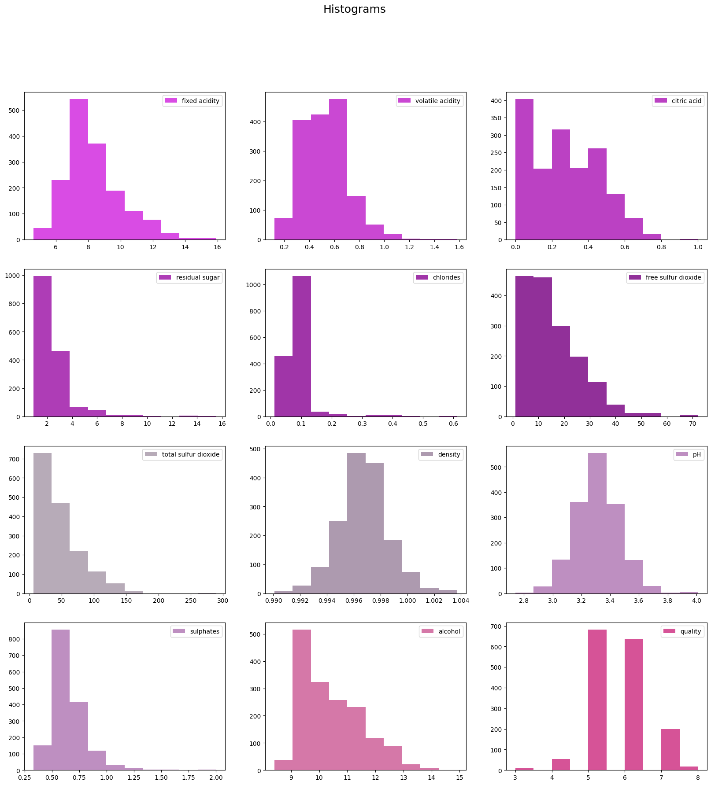
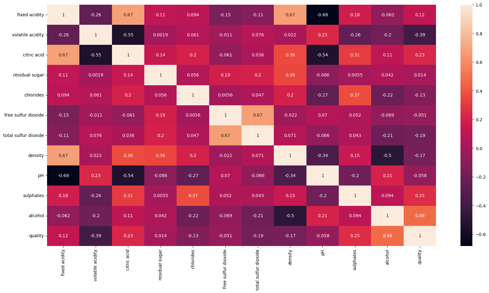
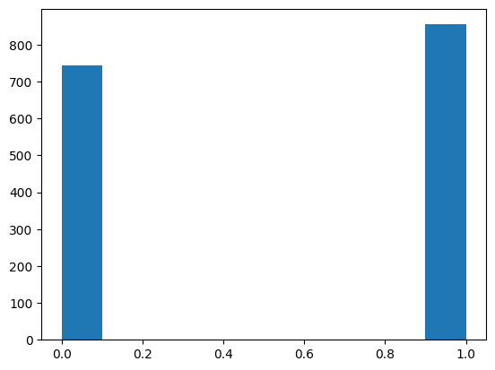
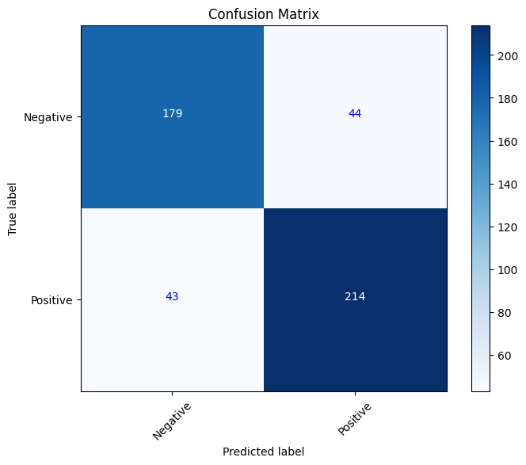

# Dataset Exploration


```python
import numpy as np
import pandas as pd
import matplotlib.pyplot as plt
import seaborn as sns
from sklearn.model_selection import train_test_split 
from sklearn.preprocessing import StandardScaler
from sklearn.ensemble import RandomForestClassifier,BaggingClassifier
from sklearn.linear_model import LogisticRegression
from sklearn.metrics import confusion_matrix
from sklearn.tree import DecisionTreeClassifier
from sklearn import metrics
```

# Exploratory Data Analysis


```python
df = pd.read_csv("winequality-red.csv")
```

## Histogram analysis to visualise the distribution of data.


```python
fig, axes = plt.subplots(nrows = 4, ncols = 3, figsize = (20, 20))

colors = ['#D94CE4', '#CA48D3', '#BB41C3', '#AE3DB6',
          '#A035A8', '#913099', '#B7ABB8', '#AD9AAF',
          '#BE8FC1', '#BE8FC1', '#D578A8', '#D65397']

for index, column in enumerate(df.columns):
    ax = axes.flatten()[index]
    ax.hist(df[column], color = colors[index], label = column)
    ax.legend(loc = "best")
plt.suptitle("Histograms", size = 18)

plt.show()
```


    

    


## To find the correlation of data to quality..


```python
plt.figure(figsize = [20, 10], facecolor = 'white')
sns.heatmap(df.corr(), annot = True)
```


    <Axes: >


    

    


## Multicollinearity between variables present
- Volatile acidity and Citric Acid
- Density and Fixed Acidity
- free Sulphur Dioxide and Total Sulphur Dioxide
- We must be cautious with these variables as they can cause errors in the model.


```python
df["quality"] = np.where(df["quality"] > 5, 1, 0)
```


```python
df['quality'].unique()
plt.hist(df['quality'])
```


    (array([744.,   0.,   0.,   0.,   0.,   0.,   0.,   0.,   0., 855.]),
     array([0. , 0.1, 0.2, 0.3, 0.4, 0.5, 0.6, 0.7, 0.8, 0.9, 1. ]),
     <BarContainer object of 10 artists>)


    

    


## The output data "quality" ranges from 5 to 8, so we will split 3 to 5 as bad wine and 6-8 as good wine.

# Data Processing

## Scaling


```python
y = df['quality']
X = df.drop(['citric acid','free sulfur dioxide','density','quality'],axis = 1)
print(X)
```

          fixed acidity  volatile acidity  residual sugar  chlorides   
    0               7.4             0.700             1.9      0.076  \
    1               7.8             0.880             2.6      0.098   
    2               7.8             0.760             2.3      0.092   
    3              11.2             0.280             1.9      0.075   
    4               7.4             0.700             1.9      0.076   
    ...             ...               ...             ...        ...   
    1594            6.2             0.600             2.0      0.090   
    1595            5.9             0.550             2.2      0.062   
    1596            6.3             0.510             2.3      0.076   
    1597            5.9             0.645             2.0      0.075   
    1598            6.0             0.310             3.6      0.067   
    
          total sulfur dioxide    pH  sulphates  alcohol  
    0                     34.0  3.51       0.56      9.4  
    1                     67.0  3.20       0.68      9.8  
    2                     54.0  3.26       0.65      9.8  
    3                     60.0  3.16       0.58      9.8  
    4                     34.0  3.51       0.56      9.4  
    ...                    ...   ...        ...      ...  
    1594                  44.0  3.45       0.58     10.5  
    1595                  51.0  3.52       0.76     11.2  
    1596                  40.0  3.42       0.75     11.0  
    1597                  44.0  3.57       0.71     10.2  
    1598                  42.0  3.39       0.66     11.0  
    
    [1599 rows x 8 columns]


# Model building
- Since we are differentiating between good and bad wine we will build a Voting Classifier using Logistic Regression, Bagging and Random forest to produce accurate predictions about the quality of the wine

## Split data into test and train.


```python
X_train, X_test, y_train, y_test = train_test_split(X, y, test_size=0.3, random_state=23)
sc = StandardScaler()#Scale down the data
X_train[X_train.columns] = sc.fit_transform(X_train)
X_test[X_test.columns] = sc.fit_transform(X_test)
```

# Logistic regression model


```python
# Create a logistic regression model
log_model = LogisticRegression()
# Train the model
log_model.fit(X_train, y_train)
# Make predictions on the test set
y_pred_log = model.predict(X_test)
```

## Logistic Regression model evaluation using:
- Accuracy score
- Precision score
- Recall score
- Confusion matrix


```python
accuracy = metrics.accuracy_score(y_test, y_pred_log)
precision = metrics.precision_score(y_test, y_pred_log)
recall = metrics.recall_score(y_test, y_pred_log)

print("Accuracy:", accuracy)
print("Precision:", precision)
print("Recall:", recall)
# Create a confusion matrix
conf_matrix = confusion_matrix(y_test, y_pred_log)

# Plot the confusion matrix
plt.figure(figsize=(8, 6))
plt.imshow(conf_matrix, interpolation='nearest', cmap=plt.cm.Blues)
plt.title('Confusion Matrix')
plt.colorbar()

classes = ['Negative', 'Positive']
tick_marks = np.arange(len(classes))
plt.xticks(tick_marks, classes, rotation=45)
plt.yticks(tick_marks, classes)

plt.xlabel('Predicted label')
plt.ylabel('True label')

for i in range(len(classes)):
    for j in range(len(classes)):
        plt.text(j, i, format(conf_matrix[i, j], 'd'), horizontalalignment='center', color='white' if conf_matrix[i, j] > conf_matrix.max() / 2 else 'blue')

plt.show()
```

    Accuracy: 0.8145833333333333
    Precision: 0.8255813953488372
    Recall: 0.8287937743190662


    

    


## Random Forest Classifier


```python
model = RandomForestClassifier()

# fit the model with the training data
model.fit(X_train,y_train)

# number of trees used
print('Number of Trees used : ', model.n_estimators)

# predict the target on the train dataset
y_pred_rf = model.predict(X_test)
```

    Number of Trees used :  100


## Random Forest Classifier evaluation
- Accuracy score
- Precision score
- Recall score
- Confusion matrix


```python
accuracy = metrics.accuracy_score(y_test, y_pred_rf)
precision = metrics.precision_score(y_test, y_pred_rf)
recall = metrics.recall_score(y_test, y_pred_rf)
print("Accuracy:", accuracy)
print("Precision:", precision)
print("Recall:", recall)
# Create a confusion matrix
conf_matrix = confusion_matrix(y_test, y_pred_rf)

# Plot the confusion matrix
plt.figure(figsize=(8, 6))
plt.imshow(conf_matrix, interpolation='nearest', cmap=plt.cm.Blues)
plt.title('Confusion Matrix')
plt.colorbar()

classes = ['Negative', 'Positive']
tick_marks = np.arange(len(classes))
plt.xticks(tick_marks, classes, rotation=45)
plt.yticks(tick_marks, classes)

plt.xlabel('Predicted label')
plt.ylabel('True label')

for i in range(len(classes)):
    for j in range(len(classes)):
        plt.text(j, i, format(conf_matrix[i, j], 'd'), horizontalalignment='center', color='white' if conf_matrix[i, j] > conf_matrix.max() / 2 else 'blue')

plt.show()
```

    Accuracy: 0.81875
    Precision: 0.8294573643410853
    Recall: 0.8326848249027238


    

    


## Bagging Classifier


```python
bag_model = BaggingClassifier(DecisionTreeClassifier(random_state=83))
bag_model.fit(X_train, y_train)
y_pred_bag = bag_model.predict(X_test)
```

## Bagging classifier evaluation


```python
accuracy = metrics.accuracy_score(y_test, y_pred_bag)
precision = metrics.precision_score(y_test, y_pred_bag)
recall = metrics.recall_score(y_test, y_pred_bag)

print("Accuracy:", accuracy)
print("Precision:", precision)
print("Recall:", recall)
# Create a confusion matrix
conf_matrix = confusion_matrix(y_test, y_pred_bag)

# Plot the confusion matrix
plt.figure(figsize=(8, 6))
plt.imshow(conf_matrix, interpolation='nearest', cmap=plt.cm.Blues)
plt.title('Confusion Matrix')
plt.colorbar()

classes = ['Negative', 'Positive']
tick_marks = np.arange(len(classes))
plt.xticks(tick_marks, classes, rotation=45)
plt.yticks(tick_marks, classes)

plt.xlabel('Predicted label')
plt.ylabel('True label')

for i in range(len(classes)):
    for j in range(len(classes)):
        plt.text(j, i, format(conf_matrix[i, j], 'd'), horizontalalignment='center', color='white' if conf_matrix[i, j] > conf_matrix.max() / 2 else 'blue')

plt.show()
```

    Accuracy: 0.7729166666666667
    Precision: 0.7913385826771654
    Recall: 0.7821011673151751


    

    


# Voting Classifier


```python
from sklearn.ensemble import VotingClassifier
#create a dictionary of our models
estimators=[('bag', bag_model), ('rf', model),('log_reg',log_model)]
#create our voting classifier, inputting our models
ensemble = VotingClassifier(estimators, voting='hard')
#fit model to training data
ensemble.fit(X_train, y_train)
#test our model on the test data
y_pred_ens = ensemble.predict(X_test)


```

    Accuracy: 0.8229166666666666
    Precision: 0.8385826771653543
    Recall: 0.8287937743190662


## Voting Classifier evaluation


```python
accuracy = metrics.accuracy_score(y_test, y_pred_ens)
precision = metrics.precision_score(y_test, y_pred_ens)
recall = metrics.recall_score(y_test, y_pred_ens)
print("Accuracy:", accuracy)
print("Precision:", precision)
print("Recall:", recall)
# Create a confusion matrix
conf_matrix = confusion_matrix(y_test, y_pred_ens)

# Plot the confusion matrix
plt.figure(figsize=(8, 6))
plt.imshow(conf_matrix, interpolation='nearest', cmap=plt.cm.Blues)
plt.title('Confusion Matrix')
plt.colorbar()

classes = ['Negative', 'Positive']
tick_marks = np.arange(len(classes))
plt.xticks(tick_marks, classes, rotation=45)
plt.yticks(tick_marks, classes)

plt.xlabel('Predicted label')
plt.ylabel('True label')

for i in range(len(classes)):
    for j in range(len(classes)):
        plt.text(j, i, format(conf_matrix[i, j], 'd'), horizontalalignment='center', color='white' if conf_matrix[i, j] > conf_matrix.max() / 2 else 'blue')

plt.show()
```

    Accuracy: 0.8229166666666666
    Precision: 0.8385826771653543
    Recall: 0.8287937743190662


    

    


# Saving the model


```python
import pickle as pickle
model_filename = 'voting_model.htf'
with open(model_filename, 'wb') as file:
    pickle.dump(ensemble, file)
print(f'Model saved to {model_filename}')
```

    Model saved to voting_model.htf


```python

```
